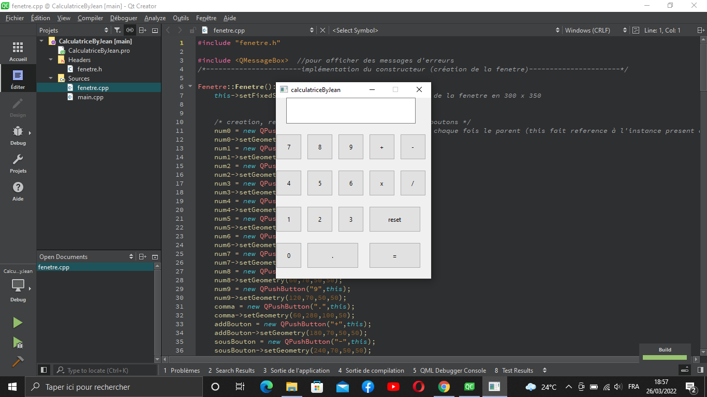

#Calculatrice Qt

##C'est une calculatrice qui permet de calculer les opérations de base comme l'addition(+), la soustraction(-), la division(/) et la multiplication(x)

##Pour ce Projet j'ai utilisé le framework Qt pour implémenter l' interface visuel(les widgets)

##Il s'agit de mon premier projet avec Qt et a aussi pour intérêt de me familiariser avec ce framework

